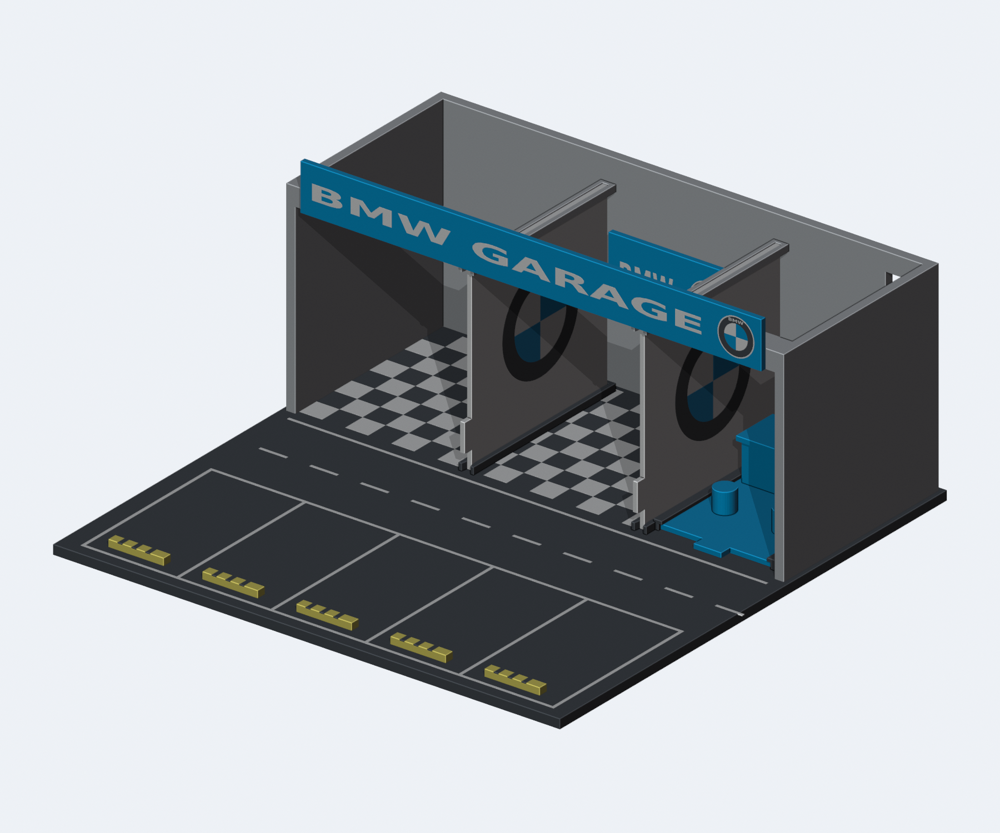

# 可换品牌车库 V2 — 工程初稿

**状态：已建模、已做数字装配检查；尚未切片验证和实物试打，不是定版打印文件。**

本版按新的模块化需求重新建模，不沿用旧版安装结构。旧版 `../Garage_BMW.3mf` 和 Honda 原文件均未覆盖。延续两处展示空间、右侧办公室、前方五车位的布局；不保证旧版灯具安装位或实体兼容。

## 设计思路：结构长期复用，品牌按套更换

目标不是给同一个车库反复改色，而是把它拆成**长期使用的通用结构**和**可独立设计的品牌套件**。以后从 BMW 换成其他品牌，只需要重新制作盘3、盘4、盘6，不重新打印道路、屋顶、外墙和挡车器。

### 为什么这样拆分

- **按变化频率分层**：道路、建筑和挡车器的作用不随品牌变化，放在盘1/2/5；隔板、招牌和办公室最能体现品牌差异，放在盘3/4/6。
- **办公室不是通用家具**：接待台、地面主色、陈设也属于品牌风格，所以盘6不是简单去掉 Logo，而是整套托盘可换。
- **接口与外观分离**：通用件只认识槽、插脚和托盘边缘，不认识 BMW 圆标。不同品牌遵守同一接口尺寸，就能共享通用件。

### 为什么从正面换，而不是拆屋顶

车库装好后，上方会被屋顶和可能增加的照明遮挡。从顶部拔隔板意味着每次换品牌都得拆主体。因此三类品牌件都从正面进入，抓取点也放在前缘。

门头特意抬到隔板顶边以上，避免“先拆门头才能换隔板”的依赖。隔板和办公室采用“向前抽出导轨，再向上拿走”的动作，避免长距离拖动时撞到停车挡车器。实际换件前仍需先移走车辆和临时摆件。

### 为什么不用一种连接方式解决所有零件

- **隔板高而薄**：上下双导槽负责导向和限制侧摆，后止挡负责插入深度。
- **招牌短而宽**：双插脚限制转动，背面贴靠安装面，适合直接前后插拔。
- **办公室低而重**：托盘侧轨和压边承接整个模块，不让用户逐个拆凳子和接待台。

三种接口对应不同受力和操作方式，但遵循相同原则：定位形状标准化、前端可抓取、品牌连接处不用胶水。

### 为什么先做间隙小样，不直接定版

打印件的收缩、象脚、长板翘曲和材料摩擦无法只靠 CAD 判断。过紧会卡死或损坏零件，过松又会晃动。因此先使用名义单边 0.30 mm 间隙，并准备 0.20 / 0.30 / 0.40 mm 三档测试件。

本阶段先验证“能装、能拆、不会相撞”，再根据试打结果处理“手感好、足够稳、反复使用不松”。**当前未加入弹性锁扣或磁吸，不把滑动配合误称为可靠锁紧。**

### 本阶段的取舍与后续顺序

不考虑旧版实体兼容，允许重做通用件；优先确定可长期复用的接口，而不是维持旧版每个尺寸。当前只有 BMW 装饰和空白品牌模板，尚未实现任意品牌自动生成。

后续顺序：**接口小样 → 调整间隙/防松 → 全尺寸隔板与办公室试装 → 验证多次插拔 → 冻结接口 → 扩展其他品牌套件**。接口冻结前不建议批量打印通用件。



## 先看这些文件

| 文件（均在 `generated/`） | 用途 |
|---|---|
| `assembly-cutaway.png` | 装配剖视效果图，**仅为观察而移除了大部分屋顶** |
| `interface-plan.png` | 俯视抽换方向示意 |
| `BMW-Modular-V2-DRAFT.3mf` | BMW 工程初稿，六盘，分色实体，建议在 Bambu Studio 打开 |
| `BMW-Modular-V2-DRAFT.FCStd` | 同几何的 FreeCAD 参数化参考：Body/Sketch/Pad/Pocket 重建全部结构件（含0.20门头插孔、摩擦筋、贴靠台阶），按耗材色着色、草图默认隐藏；圆标为可编辑草图圆，字母/文字无草图等价物未包含 |
| `Brand-Template-V2-DRAFT.3mf` | 同接口空白品牌模板；盘1/2/5与 BMW 版共用完全相同的网格 |
| `Assembly-VIEW-ONLY.3mf` | 完整装配位置，用于查看；**不能直接按此布局打印** |
| `Fit-coupons.3mf` | 三档间隙的隔板/招牌接口测试件，建议先打印这个 |
| `stl/` | 按打印盘、零件、耗材拆分的网格；同一零件的分色 STL 必须作为多部件对象导入，不要各自自动居中 |
| `validation.json` | 闭合性、颜色实体重叠、装配碰撞、抽出路径抽样检查 |

## 1. 分盘职责

| 盘 | 通用/品牌 | 新版零件 |
|---|---|---|
| 1 Road and parking | **通用** | 220 × 220 × 4 mm 底板、黑白道路/棋盘地面、隔板下导轨、办公室托盘导轨、主体定位孔 |
| 2 Showroom | **通用** | 灰色屋顶和三面墙、隔板上导轨、门头和内侧招牌插孔 |
| 3 Glass | **品牌** | 两块带 BMW 圆标的滑入式隔板；可改外观，但安装边和抽出空间受约束 |
| 4 Signs | **品牌** | 双插脚门头、双插脚内侧招牌 |
| 5 Wheel stops | **通用** | 五个黄黑挡车器，不含品牌色；可固定在底板，不参与换品牌 |
| 6 Office | **品牌** | 蓝色抽拉托盘、接待台、两个凳子、桌面 BMW 圆标，整体更换 |

与上一版相比，**盘6已明确移入品牌套件**。盘1/2/5不使用蓝色耗材，所以更换品牌主色不会改变通用件外观。

## 2. 三类安装接口

坐标：X 向右、Y 向车库后方、Z 向上；抽出方向为 **−Y**。所有数值为毫米。

### G1：隔板接口，盘3 → 盘1 + 盘2

- 两条接口中心线：X = −30、45。
- 标准板体：厚 **2.00**、深 **77.00**、高 **79.30**；另有前缘抓取舌片。
- 安装后板体：Y = 22…99，Z = 4.35…83.65。
- 上、下槽宽：**2.60**，即左右各 **0.30** 的名义间隙。
- 下槽 Z = 4…7，上槽 Z = 81…84；上下各有 0.35 的端面余量。
- 导轨入口外扩，并在 Y = 99.3 设置后止挡。
- 在槽内的上下各约 3 mm 是**禁止更改的安装区域**；Logo 不得增加这两个区域的厚度。
- 抓取前缘舌片，向前抽出约 **82 mm**，脱离导轨后再上提。

上下两端导向，减少大隔板晃动；不使用需要反复掰弯的薄卡扣。隔板保持平板打印。

### S1：招牌接口，盘4 → 盘2

- 标准插脚：截面 **8 × 4**，长 **5**；末端 1 mm 收窄导入。
- 门头插孔：**8.40 × 4.40**，按实测结果改为单边 **0.20 mm**；门头插脚两侧增加浅摩擦筋。
- 内侧招牌插孔：**8.60 × 4.60**，仍为单边 **0.30 mm**；孔深留约 0.7 mm 余量，不以孔底作为主要定位面。
- 门头：面板 **200 × 20 × 2.4**，插脚中心距 **184**。
- 内侧招牌：面板 **54 × 28 × 2.4**，插脚中心距 **32**。
- 门头背后增加连续上部贴靠面，减少长招牌翘曲和不贴平；插脚主要负责定位和防滑出。
- 面板背面贴靠承接面，插脚承重；从正面推入/拔出。
- 门头底边位于 Z = **84**，隔板顶边为 Z = **83.65**，所以门头无需先拆，隔板可独立抽出。
- 内侧招牌可在两个隔板之间向前抽出；车和其他摆件应先移开。

门头位置较旧版上移，整套模型最高 Z = **104**。新版屋顶前缘增加到 Z=104 的门头背面贴靠结构；后续可根据刚度与耗材消耗进一步减薄/镂空。

### O1：办公室接口，盘6 → 盘1

- 标准托盘：宽 **48**、深 **65**、厚 **2**，另有前方抓取舌片。
- 安装区域：X = 50…98、Y = 26…91、Z = 4.3…6.3。
- 两侧导轨净宽 **48.60**；底部余量 **0.30**，上压边余量 **0.30**。
- 后止挡：Y = 91.3；前端开口。
- 托盘左右边缘各 **1.2 mm** 上方需保持无装饰，供压边覆盖。
- 向前抽出约 **74 mm** 后上提。不要一直拖到停车挡车器上。
- BMW 版家具总高度到 Z = 25；其他品牌家具不能伸出托盘侧边，且需要重新检查抽换碰撞。

**任何品牌均不得在三种接口上使用胶水。** 若需要胶合盘1/盘2或固定盘5，只能固定通用结构，不能堵住导槽。

## 3. 高度定制的边界

可以改：Logo、文字、主色、隔板中间图案、招牌可用面、办公室家具造型。当前 BMW 图案是 0.4 mm 厚的齐平分色实体，不承担连接功能。

不能随意改：插脚尺寸/间距、隔板上下安装边、托盘尺寸/侧边安装区、移动过程所占空间。扩大招牌、增加浮雕或增加家具高度以后，必须重新运行碰撞检查。

空白品牌模板移除了盘3/4/6的分色效果，但保留了它们的接口实体；其他品牌尚未绘制具体图案。生成器中的 `make_sign()`、隔板 artwork 和办公室 logo 是下一步添加品牌配置的位置。

## 4. 已检查与尚未检查

已做：
- 每个颜色网格闭合且具有正体积。
- 同零件各颜色实体无有意义的体积重叠。
- 全部零件在名义安装位置无实体干涉。
- 品牌件沿上述“前抽后抬”路径，每 **2 mm** 抽样检查，未发现干涉；这不是连续运动的严格数学证明。
- 六盘布局边界检查，以及 Bambu Studio CLI 导入检查。

尚未做/必须注意：
- **没有实物测量、没有验证插拔力、抗晃动和多次插拔寿命。**
- 隔板和办公室仍使用 0.30 mm 滑动间隙，**不是过盈卡紧量**。门头招牌已根据小样改为 0.20 mm 插孔并加入浅摩擦筋，但仍需复打验证；移动整套模型前应取下品牌件，勿倒置。
- 已根据首轮小样结果对门头加入小摩擦筋和背面贴靠面；不靠盲目缩小整个导槽解决防松。
- 隔板/托盘长件的翘曲、小样与整件的收缩差异需用全尺寸件再验证。
- 小圆标中的细字需检查喷嘴实际能否生成路径。
- 屋顶朝下打印；插孔短桥接、办公室托盘导轨悬挑、接待台桌沿均要检查支撑设置。**没有作出整套免支撑的承诺。**
- 沿用工程中的 X2D/0.4 mm 配置作为载体，不代表适合你的当前打印机；切片前重新核对打印机、工艺和耗材/AMS。
- 透明隔板不是玻璃材料模拟；默认使用白色 PLA。如果改为透明耗材，需将白色圆标单独分配耗材，否则白标也会透明。
- 留有后部走线缺口，但旧版 LED 套件安装位未复刻。

## 5. 先试打什么

打开 `Fit-coupons.3mf`：
- 三列从左到右对应 **单边 0.20 / 0.30 / 0.40 mm**。
- 四行从下到上依次为导槽、2 mm 小隔板、插孔、插脚；对象名称也标有 gap。
- 测试件无刻字，请按盘中位置或对象名称区分。
- 隔板平放打印；插脚面板朝下；插孔按屋顶倒置的方向打印，尽量贴近实际接口打印方向。
- 三列公件名义尺寸相同，变量是对应母件的孔/槽；孔脚与槽板分别测试。
- 选择能轻推进入、无明显卡滞且晃动可接受的一档，反复插拔 20 次记录情况。

这些小样**不验证办公室托盘和主体定位脚**；它们仍需后续全尺寸/专用小样试打。

## 6. 重建

```sh
cd bmw-garage/modular-v2
../.venv/bin/python generate.py
../.venv/bin/python check_exports.py
# 可选：需要本机 Blender。剖视图中的屋顶删减只影响预览。
/Applications/Blender.app/Contents/MacOS/Blender --background --python render_preview.py
# 可选：FreeCAD 参数化参考文件（体素校验与网格比对结果见 freecad-parametric-validation.json）
PYTHONPATH=/Applications/FreeCAD.app/Contents/Resources/lib ../.venv/bin/python export_freecad.py
```

`generate.py` 使用上一层 `convert_to_bmw.py` 的文字、圆标和网格辅助函数；无需修改或重新生成 V1。`generated/preview-meshes.json` 是渲染中间数据，不作为打印输入。
