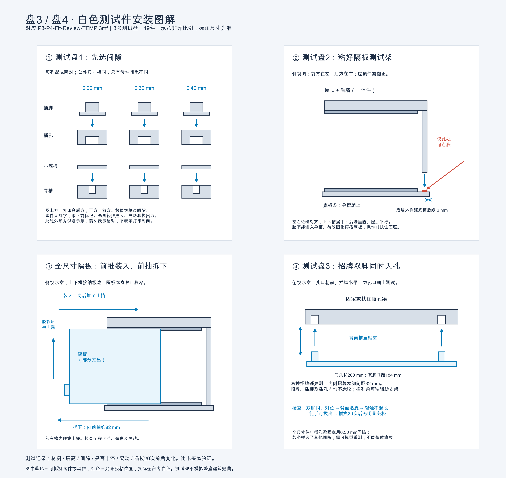

# 临时盘3/盘4接口试打

## 图解安装指南

[查看高清图](assembly-guide.png) · [下载打印版 PDF](assembly-guide.pdf)

文件：`P3-P4-Fit-Review-TEMP.3mf`。三盘、19个对象，每件均为单一白色实体，无Logo和文字；不修改原六盘工程。齐平图案已并入基体，外形、接口及间隙不变。这里的“测试盘2/3”不是原项目盘号。

## 测试盘1：间隙筛选（12件）

从左到右为单边 0.20 / 0.30 / 0.40 mm；从前到后（打印盘 Y 由小到大）依次为导槽、小隔板、插孔、插脚。对象名称标明类型和间隙；实物无刻字，取下前请标记。三组公件名义尺寸相同，母件间隙不同。

隔板平放、招牌面朝下、插孔按原屋顶倒置朝向打印。用最终计划采用的材料及工艺测试，不能用不同材料的小样直接推断最终松紧。

- 检查轻推是否能装入、有无象脚卡滞、左右晃动。
- 插孔件按真实安装方向拿持（插孔水平朝前），测试插脚是否会自行退出。
- 反复插拔20次，记录松动变化、白化或裂纹。
- 目标是可徒手拆换且正常摆放不自行脱出，并非越紧越好。

## 测试盘2：全尺寸隔板及测试架（3件）

包含一块去掉图案的全尺寸隔板，以及从原模型裁出的底板条、屋顶+后墙条。上下导槽长度、间距、后止挡及隔板外形均保留，间隙固定为当前版单边0.30 mm。

组装方法：
1. 底板导轨朝上；将屋顶+后墙件翻到屋顶在上、上导槽朝下的装配方向。
2. 后墙下端立在底板上，左右边缘对齐。**后墙外表面距底板后缘2 mm**；屋顶前缘也比底板前缘后退2 mm。上下槽中心线对齐。
3. 可以用胶将后墙底端固定到底板，保持后墙垂直、屋顶与底板平行。只粘测试架，胶不能进入导槽，不能粘隔板。测试架窄，应夹持底座操作。
4. 胶固化后从正面插入隔板至后止挡。前缘舌片用于抓取；向前抽出约82 mm后再上提。

检查全长卡滞、长板翘曲、上下双轨约束下的晃动和20次插拔后的变化。小样通过不代表全尺寸一定通过。此窄测试架不模拟完整屋顶/底板的大面积翘曲，也不验证与其他家具的碰撞。

## 测试盘3：实际招牌与插孔梁（4件）

- 200 mm门头原件 + 对应插孔梁（双脚中心距184 mm）。
- 内侧招牌原件 + 对应插孔梁（双脚中心距32 mm）。

插孔梁直接裁自原主体，保留孔形、孔距、孔深和原屋顶朝下的打印方向；固定单边0.30 mm间隙。把插孔梁拿到孔口水平朝前的位置，或固定在临时直角支架上再测试，不能只朝上摆放靠重力判断牢固。

检查双脚能否同时入孔、招牌背面能否贴靠、端部翘曲/晃动、轻触是否滑脱、徒手拔出是否方便。反复插拔20次。两块招牌均不得使用胶。招牌为无图案平面，仅验证机械配合，不测试小字或圆标打印效果。

若盘1发现其他间隙更合适，盘2/3仍是0.30 mm，需改模型后再验证；不要把缩放整个零件当作调间隙，会同时改变高度和插脚间距。

## 打印与验证状态

- 已检查导出3MF引用、19个单色网格闭合及正体积、三盘边界和对象间至少2 mm布局间距。
- Bambu Studio CLI `--info` 导入成功；日志见 `import-check.txt`。
- **未切片、未实物试打。** 打开后重新选择实际打印机、0.4 mm喷嘴工艺和耗材/AMS；原载体的X2D配置不代表当前打印机可用。
- 全部对象仅使用1号白色耗材，无需多色换料；请选择最终计划采用的材料类型以验证配合。
- 检查插孔短桥接和测试架切片；如需支撑，尽量不在配合面生成，清理后的毛刺也会影响测试。
- 测试架和插孔梁可用胶固定到辅助支架；隔板、招牌始终保持免胶。

重建：在 `modular-v2/` 执行 `../.venv/bin/python make_temp_fit_review.py`。
